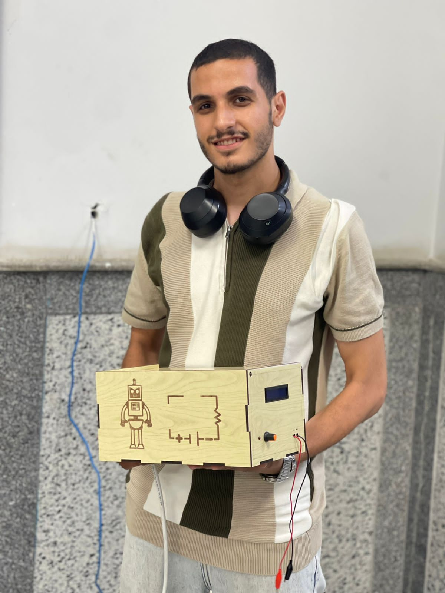
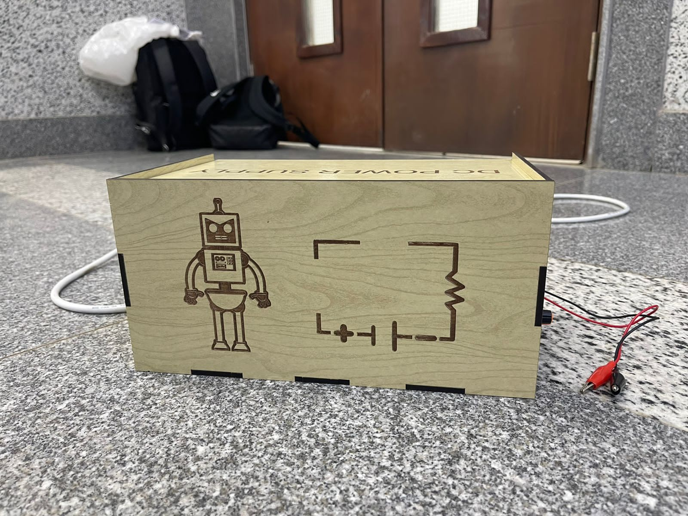
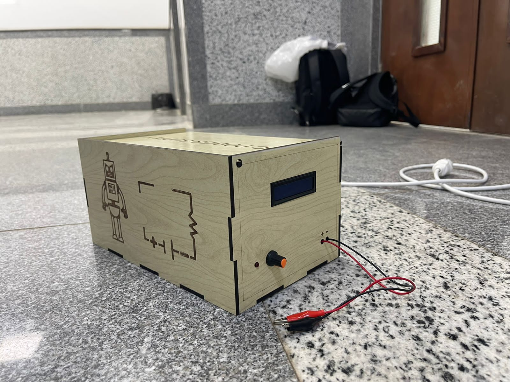
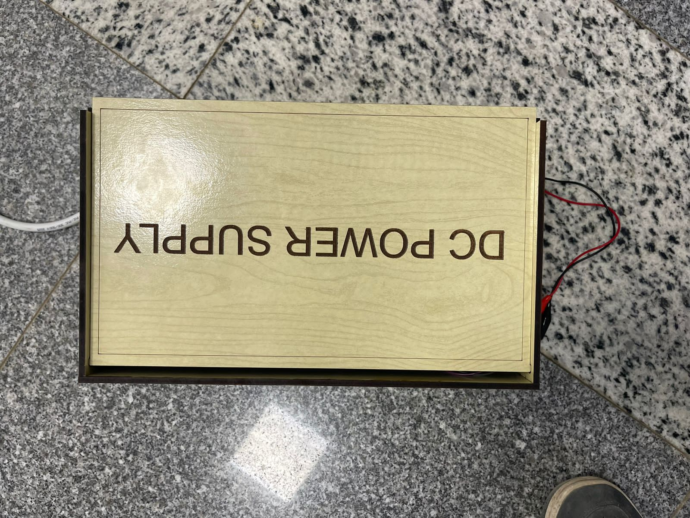
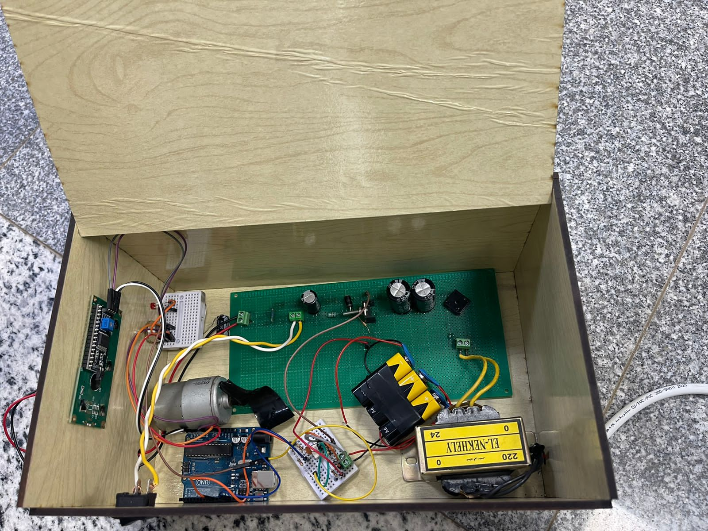

# Variable DC Power Supply — Arduino + OLED + Custom Enclosure

A fully hand-built **variable DC power supply** that converts 220V AC mains into a smooth, adjustable DC output — controlled by an Arduino, displayed on an OLED screen, and housed in a custom **laser-engraved wooden enclosure**.

> **Course:** Power Electronics — Helwan National University, Robotics & Mechatronics Dept.  
> **By:** Yousef Ahmed Elbeltagy

---

## Photos

| | |
|:---:|:---:|
|  |  |
| *Yousef with the finished build* | *Laser-engraved front panel — robot mascot + circuit schematic* |

| | |
|:---:|:---:|
|  |  |
| *Front panel — OLED display, rotary knob, output terminals* | *Top panel — "DC POWER SUPPLY" laser engraving* |


*Inside the box — transformer, PCB, Arduino UNO, OLED module, and filter capacitors*

---

## How It Works

The power supply follows the classic **AC → DC conversion pipeline**, enhanced with Arduino-based digital control:

```
220V AC Mains
     │
     ▼
[Step-Down Transformer]  →  24V AC
     │
     ▼
[Bridge Rectifier + Filter Capacitors]  →  Pulsating DC → Smoothed DC
     │
     ▼
[Voltage Regulator / Potentiometer]  →  Variable DC Output
     │
     ▼
[Arduino UNO]  →  Reads output voltage via ADC
     │
     ▼
[OLED Display]  →  Shows real-time voltage value
     │
     ▼
[Output Terminals]  →  Red (+) / Black (−) alligator clips
```

---

## Key Features

| Feature | Detail |
|---|---|
| **Input** | 220V AC mains |
| **Transformer** | EL-NEKHELY 220V → 24V step-down |
| **Rectification** | Full-wave bridge rectifier |
| **Filtering** | Electrolytic capacitors for ripple reduction |
| **Voltage Control** | Rotary potentiometer — smooth manual adjustment |
| **Microcontroller** | Arduino UNO — ADC voltage sensing |
| **Display** | OLED screen — real-time voltage readout |
| **Enclosure** | Custom laser-cut & engraved wooden box |
| **Output** | Variable DC via red/black alligator clip terminals |

---

## Components Used

| Component | Purpose |
|---|---|
| EL-NEKHELY Transformer (220V/24V) | Steps down mains voltage |
| Bridge Rectifier (diodes) | Converts AC to pulsating DC |
| Electrolytic Capacitors | Filters and smooths DC output |
| Rotary Potentiometer | Manual voltage adjustment |
| Arduino UNO | Voltage sensing + display control |
| OLED Display Module | Real-time voltage display |
| Custom PCB (perfboard) | Houses rectifier + filter circuit |
| Laser-cut Wooden Box | Custom enclosure with engraved design |
| Red/Black Alligator Clips | Output terminals |

---

## Enclosure Design

The enclosure was designed and laser-cut from wood with:
- **Side panel** — laser-engraved robot mascot + resistor-capacitor circuit schematic
- **Top panel** — "DC POWER SUPPLY" engraving
- **Front panel** — OLED display window + rotary knob cutout + output terminal holes
- **Finger-joint construction** — precise interlocking edges for a clean fit

---

## Project Structure

```
DC-Variable-Power-Supply/
├── docs/
│   ├── photos/
│   │   ├── builder_with_device.jpeg    # Yousef holding the finished build
│   │   ├── enclosure_design.jpeg       # Laser-engraved front panel
│   │   ├── front_panel.jpeg            # OLED + knob + terminals
│   │   ├── top_view.jpeg               # Top panel engraving
│   │   └── internal_components.jpeg   # Inside: PCB, Arduino, transformer
│   └── report/
│       └── DC_Power_Supply_Report.pdf  # Full project report
├── .gitignore
└── README.md
```

---

## Documentation

[`docs/report/DC_Power_Supply_Report.pdf`](docs/report/DC_Power_Supply_Report.pdf) — full project report covering circuit design, component selection, calculations, and results.
